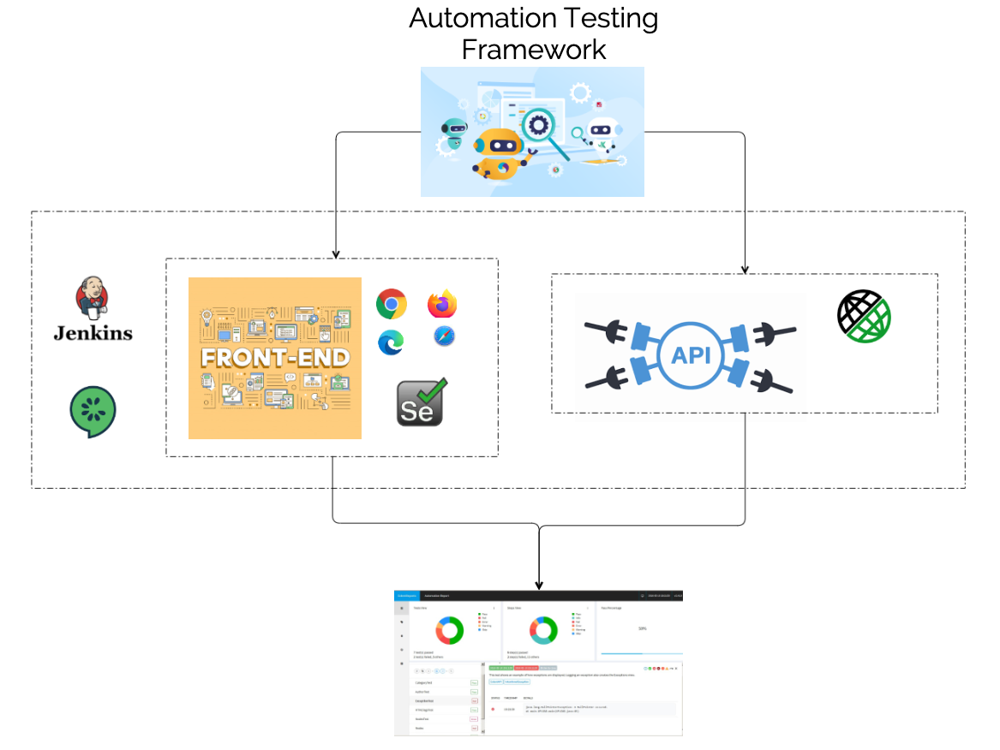
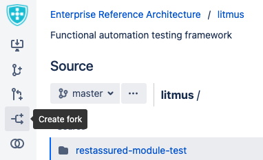
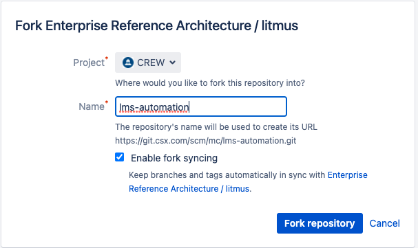
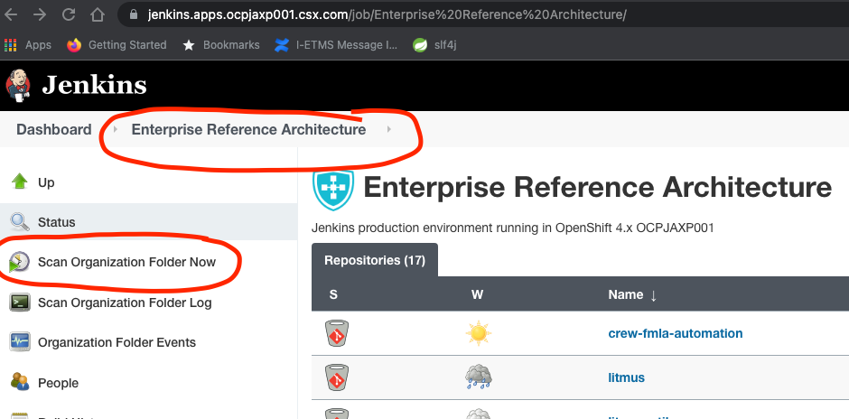
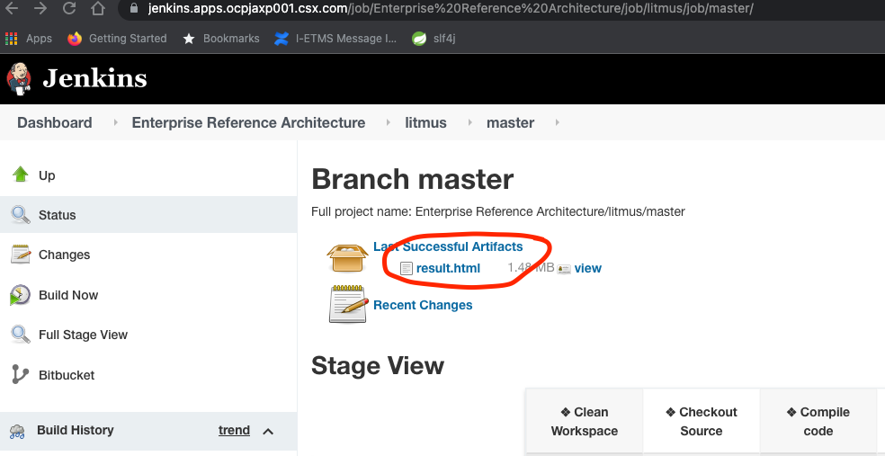
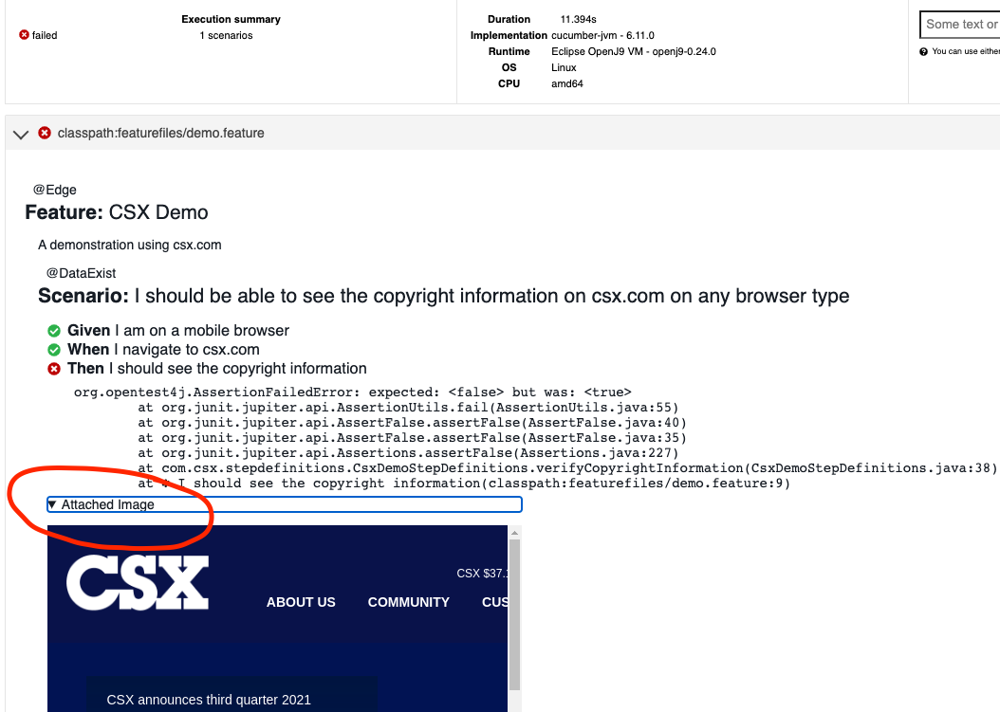

# Litmus
Litmus is functional automation testing framework for UI and API's. This framework will help to create testing scripts without worrying about the infrastructure setup to run test scripts. 

## Table of content
- [Architecture](#architecture)
- [Tools](#tools)
- [Framework Hierarchy](#markdown-header-framework-hierarchy)
- [Framework Set up](#markdown-header-framework-set-up)
- [Jenkins Integration](#markdown-header-jenkins-integration)
    - [Jenkins URL](#markdown-header-jenkins-url)
- [Reporting](#markdown-header-reporting)
  - [Screenshots](#markdown-header-screenshots)
  - [Video Recording](#markdown-header-video-recording)
- [Selenium Grid](#markdown-header-selenium-grid)
- [Browser versions](#markdown-header-bonigarcia)

# Architecture 

# Tools 
* [Selenium](https://www.selenium.dev/documentation/en/webdriver/)
* [Cucumber](https://cucumber.io/docs/cucumber/)
* [Gherkin Syntax](https://cucumber.io/docs/gherkin/)
* [Weld for Dependency Injection](https://weld.cdi-spec.org/)
* [Little bit of docker](https://www.docker.com/get-started)
* [Jenkins](https://www.jenkins.io/doc/)

# Framework Hierarchy
This framework is structured to be a multi-module. 

Let's say even if your team has multiple modules like module1, module2, module3; create only one automation repository which acts as umbrella for these sub-modules tests. Please create these sub-module modules within the main umbrella test repository. 

> **_NOTE:_** For multi-module team please create only *one automation repository*. Do not create multiple automation repositories.

Framework is designed to give reports individually to each sub-module. This approach helps us to see smoke testing reports of all the modules in single place in [Jenkins](#Jenkins Integration).

# Framework Set up
1. Fork this [repo](https://git.csx.com/projects/ENTREF/repos/litmus/browse). 
   

3. After forking the repo, give the name to this repo, for example [team name]-automation.
   

5. If needed please change the name in pom.xml too. Even if we do not change it, it is not going to having any impact because we do not create artifact of this repo.
6. It is recommended to change the modules (selenium, rest-assured) names as per teams requirements.
7. Dont forget to update this README.md after forking :D.
> **_NOTE:_** While changing the repository name please do not forget to handle this change in main pom xml. If you are changing sub-module name please change accordingly in sub-module pom xml and in main pom dependencies section. 

# Jenkins Integration
This framework is automatically linked to Jenkins because of Jenkinsfile in the repository. To know more about the content of the Jenkinsfile please refer to this [link](https://git.csx.com/projects/JENK/repos/jenkins-lib-web-automation-testing/browse). Please read carefully about *cucumberTagToRun* in this link. 

## Jenkins URL
This is the [base url of jenkins](https://jenkins.apps.ocpjaxp001.csx.com/). In order to see your automation repository in jenkins please navigate to your team folder and look for your automation repository.

> **_NOTE:_** If you do not see your automation repository in jenkins, please click *Scan Organization Folder Now* under your team in jenkins.

# Reporting
Framework is inbuilt with reports for test scripts results, these reports can be seen in [Jenkins](#Jenkins URL) in *Artifacts*.

## Screenshots
Framework integrated with capability to take screenshots automatically when a test script fails. These screenshots are integrated in [report](#Reporting) automatically. 

## Video Recording
Video recording is enabled only for local environment because of resources constraint in higher environments.

> **_NOTE_** *localVideoRecord* is system property used to enable/disable video recording functionality. By default video recording is disabled. In order to enable video recording please add system property *localVideoRecord* value to be *true* in either eclipse or maven command.

# Bonigarcia
In order to handle selenium drivers for different browser versions and operating systems, this framework uses external dependency called [bonigarcia](https://github.com/bonigarcia/webdrivermanager).

# Selenium Grid
In order to get more information about selenium grid integration with this framework, please visit this [wiki link](https://wiki.csx.com/display/AD/Selenium+Grid).
